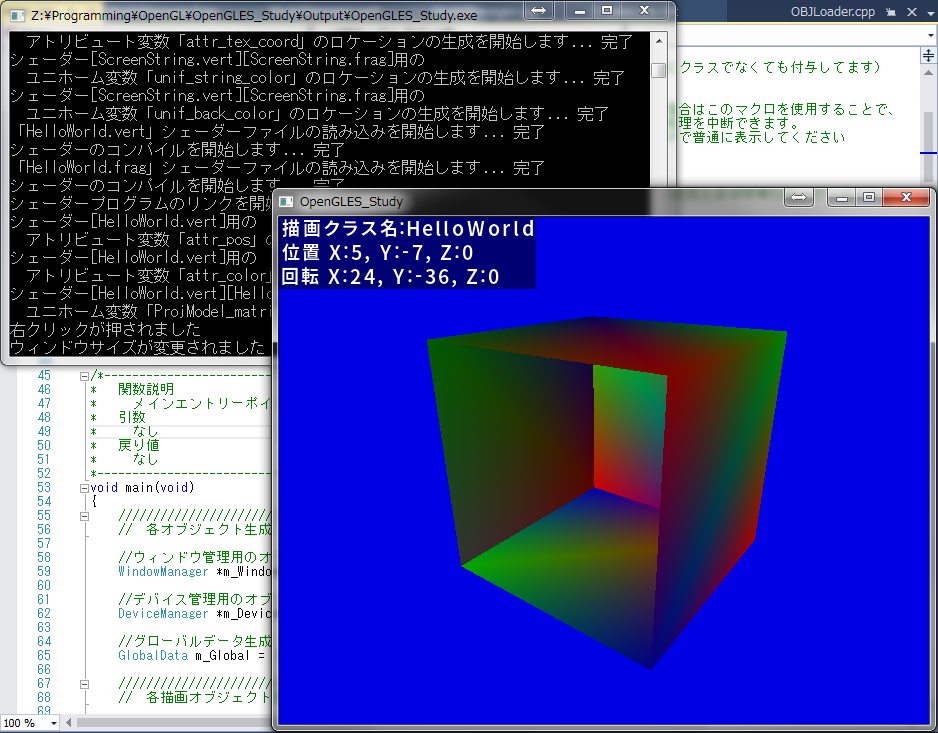
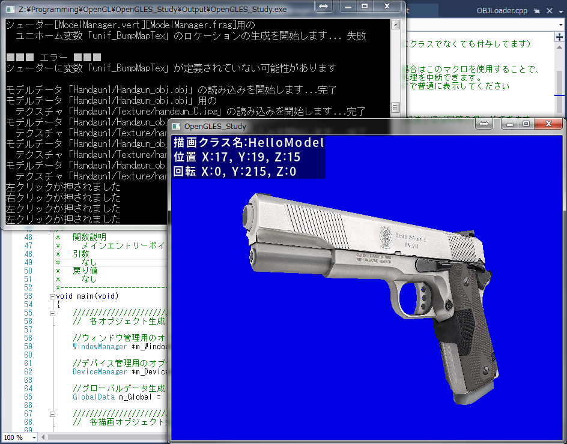

# OpenGLES_Study

###このプロジェクトは何？
------------------------------------------------------------------
OpenGLESの勉強を始めようとする人向けのプロジェクトです。  
本プロジェクトは、OpenGLESの動作確認 及び デバックを「Visual Studio(2015以降)」上で可能にしたものです。  
OpenGLESの導入で壁となる難しい部分を極力排除して、手軽に楽しんで頂く目的で作成を始めました。  
（ターゲットはOpenGLES3.0に設定してあります）  
※VisualStudioは2015以降が必須です（C++11で書かれたコードがあるので）

###前置き
------------------------------------------------------------------
組み込み用のグラフィックとして注目を集めている「OpenGLES」ですが、  
動作確認をするのにハードウェア（Androidとか）を用意、環境構築するのは、  
それなりに手間がかります。
しかも、OpenGLなら解説したサイトが多々あるのに、OpenGLESはなかなかありません。  
さらにPC上で動作確認する方法も、OpenGLとくらべて少なく感じます。  
（OpenGLの組み込みバージョンがOpenGLESなので、使える関数とかも違います）  

「とりあえずOpenGLESがどんなものか触ってみたい」と思っているのに、  
最初のハードルが高くて諦めてしまう人も多いのではないでしょうか？  

###特徴
------------------------------------------------------------------
本プロジェクトは「CMake」でのビルド環境生成に対応しており、  
環境構築は数ステップで完了します。  
（CMakeはコンパイラに依存しないビルド自動化のためのフリーソフトウェアです。  
詳しくは、プロジェクト内のReadme.txtファイルに記載してあります。）  

また、「OpenGLES」の初期設定や「シェーダーファイル」の読み込みといった、  
とっつきにくい部分については自作関数を用意し、ユーザーは意識すること無く使用することができます。  
実際にプログラムを作成する上でも、そのあたりは1度作ってしまえば使いまわしで、  
初めてOpenGLESを勉強や、とりあえず動作確認をする人にとっては、それほど重要ではありません。  

###動作画面
------------------------------------------------------------------

